## 产品概述

Sift 是一款 RAW+JPG 照片筛选归档工具。本次需求为两个独立功能增强：归档后的文件联动管理，以及筛选过程中的图片对比能力。

## 核心功能

### 功能一：归档后删除 JPG 联动删除 RAW

归档完成后，`JPG/` 和 `RAW/` 子文件夹中的文件按文件名 stem 一一对应。用户需要在归档完成后浏览已归档的图片，并能够删除某张 JPG 时自动找到并删除对应的 RAW 文件。

- 在归档完成页面提供"管理归档文件"入口，进入归档文件浏览模式
- 扫描归档目录的 `JPG/` 和 `RAW/` 子文件夹，按文件名 stem 配对
- 以网格形式展示已归档的 JPG 图片
- 选中图片后可执行联动删除（JPG + 对应 RAW 一起移入回收站）
- 删除后实时刷新列表

### 功能二：筛选过程中对比两张 JPG 图片

在 culling 工作流中，用户需要并排对比两张图片以做出更好的筛选决策。

- 按快捷键 C 进入对比模式，锁定当前图片为左侧基准图
- 左右切换或点击缩略图选择另一张图片显示在右侧
- 左右并排展示两张图片，各占 50% 宽度
- 按 C 或 ESC 退出对比模式，回到单图浏览
- 对比模式下缩略图条高亮两张图片（基准图 + 当前浏览图）

## 技术栈

- 前端：Vue 3 + TypeScript + Tailwind CSS + Pinia
- 后端：Rust + Tauri 2
- 图标库：lucide-vue-next
- 构建工具：Vite

## 实现方案

### 功能一：归档后文件管理（Archive Manager）

**策略**：在 Rust 后端新增 `scan_archive_folder` 命令，扫描归档产出的 `JPG/` 和 `RAW/` 子文件夹并按文件名 stem 配对返回。前端新增 `ArchiveManager` 组件，复用现有 `delete_pair` 命令实现联动删除。

**关键决策**：

1. **Rust 新增 `scan_archive_folder` 命令**：接收 `folder_path`（归档根目录），扫描 `JPG/` 子目录获取所有 JPG 文件，扫描 `RAW/` 子目录获取所有 RAW 文件，按文件名 stem（不含扩展名）配对。复用 `scan.rs` 中已有的 `is_jpg`/`is_raw` 文件类型判断和 `natord` 排序逻辑。返回的结构复用 `ScanResult`（`pairs` + 统计信息），这样前端可以用相同的 `PhotoPair` 类型处理。

2. **前端 `ArchiveManager` 组件**：在 `ArchiveDialog` 归档完成状态中新增"管理归档文件"按钮。点击后切换到归档管理视图（在 ArchiveDialog 内部增加一个新状态，而非新页面/路由），调用 `scanArchiveFolder` 扫描并展示 JPG 网格。选中图片后点击删除调用已有的 `deletePair(jpgPath, rawPath)` 命令。

3. **为什么不新建独立页面**：当前 `AppView` 只有 `welcome` 和 `culling` 两种状态，归档完成后的文件管理是一个短暂操作，在 `ArchiveDialog` 内增加一个 `isManaging` 状态即可，避免引入新的路由/视图层级，保持架构简洁。

### 功能二：对比模式（Compare Mode）

**策略**：在 `viewStore` 中新增对比模式相关状态（`compareMode`、`compareIndex`），改造 `ImageViewer` 支持并排双图布局。对比模式下，左侧固定显示锁定的基准图，右侧显示当前浏览图（`session.currentIndex`），用户通过左右键或点击缩略图切换右侧图片。

**关键决策**：

1. **状态管理放在 `viewStore`**：`compareMode: boolean` 和 `compareIndex: number | null` 放在 viewStore 中（UI 状态），而非 sessionStore（业务数据状态），保持关注点分离。`compareIndex` 记录的是被锁定的基准图在 `session.pairs` 中的索引。

2. **双图加载方案**：不改造 `useImageLoader`（它与 `session.currentIndex` 强绑定），而是为对比模式的左侧图创建一个独立的、简化的图片加载逻辑——直接使用 `convertFileSrc` 转换路径 + `` 标签，因为基准图在进入对比模式时大概率已在缓存中，无需复杂的渐进加载。右侧图继续使用现有的 `useImageLoader`，保持预加载和缓存能力。

3. **缩放处理**：进入对比模式时自动 `resetZoom()`，对比模式下禁用缩放（两张图各占 50% 宽度，`object-contain` 适配），因为并排对比的主要目的是快速比较构图和整体效果，不需要像素级对比。退出对比模式后恢复正常缩放能力。

4. **导航行为**：对比模式下，左右键/Space/→/缩略图点击只改变 `session.currentIndex`（控制右侧图）。`compareIndex` 保持不变直到用户退出对比模式。标记操作（F/X）作用于当前 `currentIndex`（右侧图），与正常模式一致。

5. **ThumbnailStrip 适配**：对比模式下需要高亮两个索引——`compareIndex`（蓝色 ring，基准图）和 `currentIndex`（现有的 accent ring，浏览图）。

## 实现细节

### 性能考量

- `scan_archive_folder` 使用 `tokio::spawn_blocking` 在后台线程执行文件扫描，避免阻塞 UI 线程，与现有 `scan_folder` 模式一致
- 对比模式左侧基准图使用 `convertFileSrc` 直接加载，不引入额外的 Image 预加载开销；右侧图复用现有 `useImageLoader` 的缓存
- ArchiveManager 中的网格图片使用 `loading="lazy"` 延迟加载，与 FilterGallery 保持一致

### 向后兼容

- 新增 Rust 命令 `scan_archive_folder`，不修改任何已有命令
- `viewStore` 新增状态不影响已有状态的读写
- `ImageViewer` 的对比布局通过 `v-if/v-else` 切换，非对比模式下渲染路径完全不变
- `ThumbnailStrip` 新增第二个高亮环，不影响现有的 currentIndex 高亮逻辑
- `useKeyboard` 新增 `C` 键处理，不影响其他快捷键

### 日志与错误处理

- `scan_archive_folder` 若 `JPG/` 或 `RAW/` 子目录不存在，返回空结果而非报错
- `ArchiveManager` 中删除失败时通过 toast 提示用户，不中断操作流
- 对比模式下若基准图被删除标记，自动退出对比模式并 toast 提示

## 架构设计

```mermaid
flowchart TD
    subgraph "功能一：归档后管理"
        A1["ArchiveDialog 完成态"] --> A2["点击'管理归档文件'"]
        A2 --> A3["调用 scanArchiveFolder"]
        A3 --> A4["Rust: 扫描 JPG/ + RAW/ 配对"]
        A4 --> A5["ArchiveManager 展示网格"]
        A5 --> A6["用户选中并点击删除"]
        A6 --> A7["调用 deletePair(jpg, raw)"]
        A7 --> A8["刷新列表"]
    end

    subgraph "功能二：对比模式"
        B1["用户按 C 键"] --> B2["viewStore.toggleCompare()"]
        B2 --> B3["锁定 compareIndex = currentIndex"]
        B3 --> B4["ImageViewer 切换并排布局"]
        B4 --> B5["左侧: compareIndex 固定图"]
        B4 --> B6["右侧: currentIndex 浏览图"]
        B6 --> B7["用户左右切换/点击缩略图"]
        B7 --> B6
        B5 --> B8["按 C/ESC 退出对比模式"]
    end
```



## 目录结构

```
src-tauri/src/
├── commands/
│   ├── mod.rs                      # [MODIFY] 新增 archive_manager 模块声明
│   └── archive_manager.rs          # [NEW] scan_archive_folder 命令。扫描归档目录的 JPG/ 和 RAW/ 子文件夹，按文件名 stem 配对返回 ScanResult。复用 file_types 工具函数和 natord 排序。使用 tokio::spawn_blocking 异步执行。
├── models/
│   └── photo.rs                    # 无需修改，复用现有 PhotoPair 和 ScanResult
└── lib.rs                          # [MODIFY] 注册 archive_manager::scan_archive_folder 命令

src/
├── services/
│   └── tauriCommands.ts            # [MODIFY] 新增 scanArchiveFolder 函数，调用 scan_archive_folder 命令返回 ScanResult
├── stores/
│   └── viewStore.ts                # [MODIFY] 新增 compareMode、compareIndex 状态和 toggleCompare/exitCompare 方法
├── composables/
│   └── useKeyboard.ts              # [MODIFY] 新增 C 键切换对比模式，对比模式下 ESC 退出对比
├── components/
│   ├── archive/
│   │   ├── ArchiveDialog.vue       # [MODIFY] 完成态新增"管理归档文件"按钮，isManaging 状态切换到 ArchiveManager
│   │   └── ArchiveManager.vue      # [NEW] 归档文件管理组件。调用 scanArchiveFolder 获取配对列表，展示 JPG 网格缩略图，支持选中并联动删除（JPG+RAW），删除后刷新列表。复用 FilterGallery 的网格样式和 deletePair 命令。
│   └── viewer/
│       ├── ImageViewer.vue         # [MODIFY] 支持对比模式并排布局：compareMode 时左右 50% 各渲染一张图，左侧用 compareIndex 加载基准图，右侧继续用 useImageLoader 加载当前图。进入对比模式自动 resetZoom，禁用缩放交互。
│       └── ThumbnailStrip.vue      # [MODIFY] 对比模式下为 compareIndex 添加第二个高亮环（蓝色虚线 ring），与 currentIndex 的 accent ring 区分。
```

## 关键数据结构

```rust
// archive_manager.rs - 复用现有 ScanResult 和 PhotoPair，无需新增结构体
// scan_archive_folder(folder_path: String) -> Result<ScanResult, String>
// 扫描 folder_path/JPG/ 和 folder_path/RAW/，按 stem 配对
```

```typescript
// viewStore.ts 新增状态
// compareMode: Ref<boolean>    — 是否处于对比模式
// compareIndex: Ref<number | null> — 被锁定的基准图索引
```

## Agent Extensions

### SubAgent

- **code-explorer**
- Purpose: 在实现过程中如遇到未读取的关联文件（如 SkeletonImage 组件、其他 composable 等），用于探索代码上下文和验证依赖关系
- Expected outcome: 获取准确的代码上下文，确保修改不遗漏依赖点和不破坏现有功能