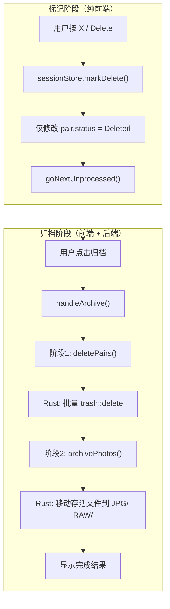

## 用户需求

### 核心问题 1：标记删除延迟执行

当前实现中，用户按下 X/Delete/Backspace 标记删除时，文件会**立即**被移入系统回收站（通过 Rust `trash::delete()`），没有容错空间。用户要求改为：

- 标记删除时仅修改前端状态为 Deleted，不触发任何文件操作
- 在最后归档时，才真正将被标记为 Deleted 的文件移入系统回收站
- 撤销操作完全在前端完成，无需从回收站恢复文件

### 核心问题 2：缩略图翻页方式改为按钮

当前缩略图区域使用鼠标滚轮做水平滚动，仍然存在明显卡顿。用户要求：

- 完全移除鼠标滚轮滚动支持
- 在缩略图区域的左侧和右侧增加点击翻页按钮
- 点击按钮实现缩略图列表的分页滚动

## 产品概述

Sift 是一个 RAW+JPG 照片筛选工具，核心工作流是用户快速浏览照片并标记为"保留/删除/跳过"，最后归档。本次改动涉及两个核心体验优化。

## 核心功能

- 标记删除变为纯前端状态切换（同步操作），归档时统一执行文件删除
- 归档流程增加"删除标记文件"步骤，先删后归档
- 缩略图区域移除滚轮事件，替换为左右翻页按钮

## 技术栈

- 前端：Vue 3 + TypeScript + Tailwind CSS + Pinia
- 后端：Rust + Tauri 2
- 图标库：lucide-vue-next
- 构建工具：Vite

## 实现方案

### 问题 1：标记删除延迟到归档时执行

**策略**：将 `markDelete()` 从异步（调用后端 `deletePair`）改为纯同步的前端状态切换，与 `markStar()`/`markSkip()` 保持一致的模式。在归档时新增一个步骤：先批量删除标记为 Deleted 的文件，再归档存活文件。

**关键决策**：

1. **前端 `markDelete()` 改为同步**：不再调用 `deletePair()`，仅修改 `pair.status`，与 `markStar` 签名保持一致（返回 `'deleted' | 'undeleted'` 而非 `Promise`）。这样撤销操作也完全可靠，因为文件还在原位。
2. **Rust 新增 `delete_pairs` 批量命令**：复用现有 `trash::delete` 逻辑，支持批量删除并返回进度事件。不修改原有 `delete_pair` 命令以保持向后兼容。
3. **归档流程两阶段执行**：`ArchiveDialog.handleArchive()` 先调用 `deletePairs` 删除标记文件，再调用 `archivePhotos` 归档存活文件。进度条合并显示两个阶段。

### 问题 2：缩略图翻页按钮

**策略**：移除 `@wheel.prevent` 和 `handleWheel` 相关逻辑，在缩略图容器两侧叠加半透明左右箭头按钮。点击按钮时，容器 `scrollBy` 滚动约容器可视宽度的 80%，使用 `behavior: 'smooth'` 实现平滑滚动。

**关键决策**：

- 按钮位于 mask 渐隐区域内侧，使用绝对定位浮在缩略图条两端
- 按钮边界检测：到达左端隐藏左按钮，到达右端隐藏右按钮
- 使用 `ChevronLeft`/`ChevronRight` lucide 图标保持一致性

## 实现细节

### 性能与兼容

- `markDelete` 改为同步后，ActionBar 和 useKeyboard 中的 `await`/`.then()` 调用需同步更新，避免不必要的微任务开销
- 批量删除命令在 Rust 端使用循环 + 进度事件推送，单个文件失败不阻断整体流程（记录跳过数）
- 缩略图翻页按钮使用 CSS `transition-opacity` 做显隐动画，不影响布局

### 向后兼容

- 保留 Rust `delete_pair` 单文件命令不删除，新增 `delete_pairs` 批量命令
- `tauriCommands.ts` 中 `deletePair` 函数保留，新增 `deletePairs` 函数
- TS 类型 `ArchiveResult` 扩展 `deletedCount` 字段

## 架构设计



## 目录结构

```
src/
├── stores/
│   └── sessionStore.ts          # [MODIFY] markDelete 改为同步，移除 deletePair import
├── services/
│   └── tauriCommands.ts         # [MODIFY] 新增 deletePairs 批量删除函数
├── composables/
│   └── useKeyboard.ts           # [MODIFY] markDelete 调用从 .then() 改为同步
├── components/
│   ├── actions/
│   │   └── ActionBar.vue        # [MODIFY] handleDelete 从 async 改为同步
│   ├── archive/
│   │   └── ArchiveDialog.vue    # [MODIFY] handleArchive 增加先删后归档两阶段逻辑
│   └── viewer/
│       └── ThumbnailStrip.vue   # [MODIFY] 移除滚轮事件，添加左右翻页按钮
├── types/
│   └── index.ts                 # [MODIFY] ArchiveResult 扩展 deletedCount 字段

src-tauri/src/
├── commands/
│   └── delete.rs                # [MODIFY] 新增 delete_pairs 批量删除命令
├── models/
│   └── photo.rs                 # [MODIFY] 新增 DeletePairInput、DeleteResult 结构体
└── lib.rs                       # [MODIFY] 注册 delete_pairs 命令
```

## 关键数据结构

```typescript
// tauriCommands.ts 新增
interface DeleteResult {
  deletedCount: number;
  failedCount: number;
}
```

```rust
// photo.rs 新增
pub struct DeletePairInput {
    pub jpg_path: String,
    pub raw_path: Option<String>,
}

pub struct DeleteResult {
    pub deleted_count: usize,
    pub failed_count: usize,
}
```

## Agent Extensions

### SubAgent

- **code-explorer**
- Purpose: 如需在实现过程中探索未读取的关联文件或验证依赖关系时使用
- Expected outcome: 获取准确的代码上下文信息，确保修改不遗漏依赖点